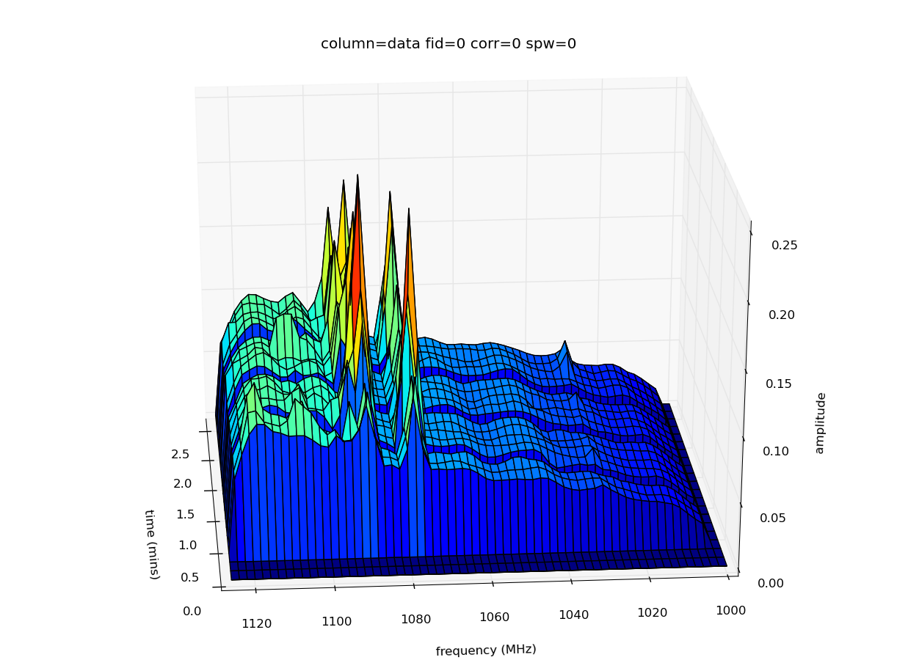

plot3d
======

[CASA](http://casa.nrao.edu/) task to quickly inspect a measurement set for RFI by plotting time vs frequency vs amplitude.

plot3d is designed to retain peak amplitudes of RFI spikes while performing data compression to speed up plotting. Your measurement set remains read-only throughout the task. If your data contains multiple scans, gaps between scans will be reset to 5 integration timescales.

Latest version: 1.3 ([download here](https://github.com/chrishales/plot3d/releases/latest))

Written by Christopher A. Hales. Correspondence regarding plot3d is always welcome.

plot3d is released under a BSD 3-Clause Licence (open source, commercially useable); refer to the licence in this repository or the header of ```task_plot3d.py``` for details.

An example screenshot of the 3D-rotatable view produced by plot3d is shown below:


Installation
======

Download the latest version of the source files from [here](https://github.com/chrishales/plot3d/releases/latest).

Place the source files into a directory containing your measurement set. Without changing directories, open CASA and type
```
os.system('buildmytasks')
```
then exit CASA. A number of files should have been produced, including ```mytasks.py```. Reopen CASA and type
```
execfile('mytasks.py')
```
To see the parameter listing, type
```
inp plot3d
```
For more details on how plot3d works, type
```
help plot3d
```
Now set some parameters and press go!

For a more permanent installation, go to the hidden directory ```.casa``` which resides in your home directory and create a file called ```init.py```. In this file, put the line
```
execfile('/<path_to_task_directory>/mytasks.py')
```

Acknowledging use of plot3d
======

plot3d is provided in the hope that it (or elements of its code) will be useful for your work. If you find that it is, I would appreciate an acknowledgement in your work and a link to https://github.com/chrishales/plot3d, but this is not required.

Happy plot3d-ing!
